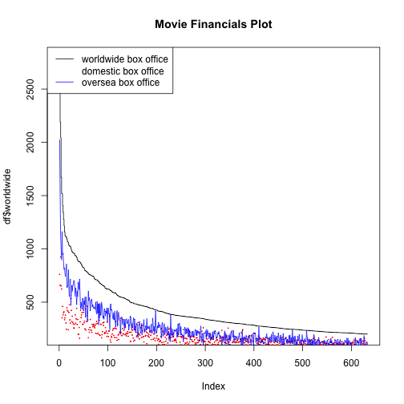

Data visualization and predictive modeling on movie data
========================================================
author: Lexie Sun
date: May 16th 2016

Data visualization and predictive modeling on movie data
========================================================

Research questions:

- How's the film industry expanding in recent years? Is there any relationship between movie financials and features?
- Can we predict the box office of a particular movie given some labels?

Project timeline:

- Data scraping, cleaning and visualization
- Data analysis and modeling 
- Conclusion 

Data Collecting
========================================================

My scrapped data are from:
- http://www.boxofficemojo.com
- http://www.imdb.com 
- http://www.rottentomatoes.com

Variables
========================================================
- continuous
  - Financials: Worldwide, Domestic, Overseas, Openingweekend, theater, weeks, budget
  - Runtime
  - Rating related:IMDB rating, rotten tomatoes rating, # of reviews
  - People (director star1 star2)
    - times of wining a movie award
    - times of nomination
- categorical
  - Studio,Release_year,MPAA, Release_date (Period), Genre
Data cleaning and manipulating
========================================================
left: 40%
Clean messy data
- split genre
- transfer opening_weekend data to numerical million level,digit=1 and fixxed ow data.
- transfer date data
- clean director and actor data
- clean title,rating  data

Some useful R packages and functions:
- gsub
- grep
- library(stringr)
  - str_split_fixed

Data manipulating:
========================================================
- Period
  1. summer season(ss):late May-late Aug(5-20,8-31)
  2. holiday season(hs):late Nov-Jan(11-20,1-7)
  3. other: (ns)
- Series movie

Create a label to distinguish a series moive or not ($series)
- Super hero movies

Create a label to distinguish super hero movie or not ($sh)
https://en.wikipedia.org/wiki/List_of_American_superhero_films

- Ratio($bb)
Create boxoffice/budget variable:($bb)

Data visualization necessary R packages
========================================================

- devtools
- knitr
- ggplot2
- easyGgplot2
- scales

Movie industry and market visualization
======================================================== 
</img>

***

</img>

Adjustment for inflation
========================================================
</img>

The pink one refers to the domestic box office revenues after adjusting for the price inflation. Compared to the original blue histogram, it is flatter.
Overseas markets expansion
======================================================== 

***
</img>

The effect of studio 
======================================================== 

</img>

As time flows, there is not a big change in the market share for each distributor. "Big Six" still have unique advantages.

What types of movies do best?
======================================================== 

</img>
Animation/Action/Sci-Fi movies are popular, especially in summer

***

</img>

What types of movies do best?
======================================================== 

</img>

On average, foreign movies and horror movies could earn a lot in holiday season than other two.

Do superhero movies always succeed?
======================================================== 
</img>

***

</img>

Do movie websites have similar rating systems?
======================================================== 

</img>

Blue: IMDb; Pink: rotten tomatoes(after transformation).
IMDb ratings are more normal distributed while the other is much flatter and have more lower values.

Data analysis and modeling
======================================================== 
Potential outcome variables: adjusted domestic boxoffice ($adjusted) or boxoffice/budget ($bb)
- Linear regression models
- Regression trees
- Random Forest

Linear regression models
======================================================== 
assumptions checked:
- Correlation matrix
</img>
Linear regression models: Normality
======================================================== 
</img>

***

</img>

Linear regression model selection
======================================================== 
| Model name    |    Outcome   | Adjusted R^2|     AIC     |
|:-------------:|:------------:|:-----------:|:-----------:|
|      res1     |log(adjusted) |     61.86%  |   75.009    |
|      res2     |   log(bb)    |       57%   |     117     |
|      res3     |log(adjusted) |     55.97%  |    86.20    |
|      res4     |   log(bb)    |     55.43%  |   118.845   |
|      res5     |   adjusted   |     47.73%  |  1171.801   |
|      res6     |      bb      |     45.89%  |  308.9774   |

</img>

Linear regression model summary
========================================================
</img>

***

</img>

Linear regression model summary
========================================================

The residual diagnostic seems fine.
From the model coefficients,
some variables including IMDb rating, non holiday season (ns&ss), series movie, director's times of winning awards show a significant positive effect on the box office. 

Regression decision tree
========================================================
Release_year,studio,genre,awards of star 1, runtime and mpaa are relatively important when predicting the outcome.
Distinctive genres: AA, Action,Adventure,Animation,Crime,Fantasy,Si-Fi,Sports,Thriller, West, War.

</img>

Random Forest
========================================================
class: small-code
</img>

genre, awards of star 1, studio, mpaa, release_year are relatively important factors.
Model comparison
========================================================
|   Model type    |     Outcome    |      MSE      |    Deviance   |
|:---------------:|:--------------:|:-------------:|:-------------:|
|linear regression|  log(adjusted) |      0.05     |      4.79     |
| decision tree   |adjusted/budget |      12.4     |      12.4     |
| random forest   |adjusted/budget |      1.86     |      1.86     |

Conclusion
========================================================
|   Model type    |     Outcome    |    Positive factor    |    Negative factor    |
|:---------------:|:--------------:|:---------------------:|:---------------------:|
|linear regression|  log(adjusted) | rating,series, year   |      genre (war)      |
| decision tree   |adjusted/budget |         release_year,studio,genre             |
| random forest   |adjusted/budget | genre, stnomi, mpaa, stwin,studio,runt,rating |

Different models return us different results. I would prefer to choose the random forest model and the linear regression model to make predictions. 
In the future, in order to make success on movie revenues, distributors should consider the genre of the movie, as well as wellknown movie stars who has already won or been nomitated for movie awards many times.

Improvement
========================================================
If I had more time, I will consider use cross validation or other methods to avoid the overfitting.
I will take more time dealing with missing data, in order to avoid the shrink of my data set.
I will try to use text mining technique on the reviews of moives and see if there is anything interesting.
 
Thanks to Yoav Bergner and anyone in this class for the advice and help. 

